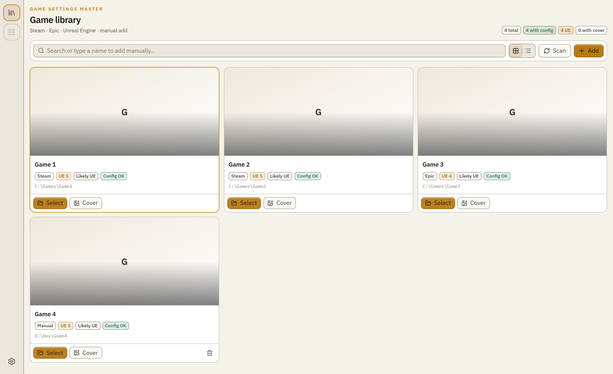
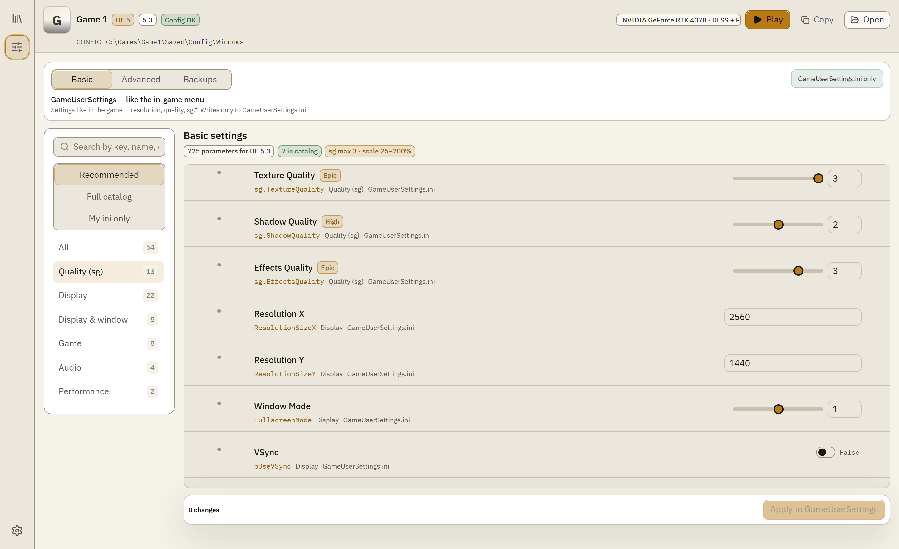
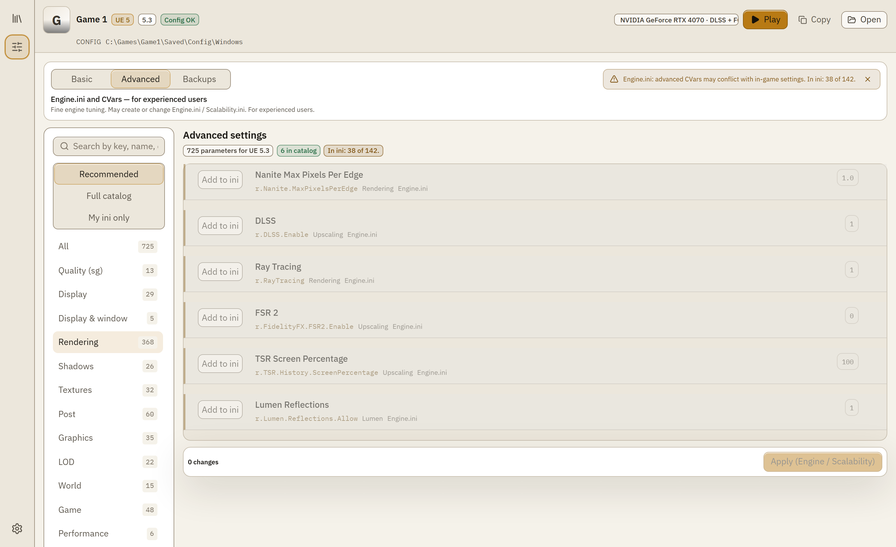
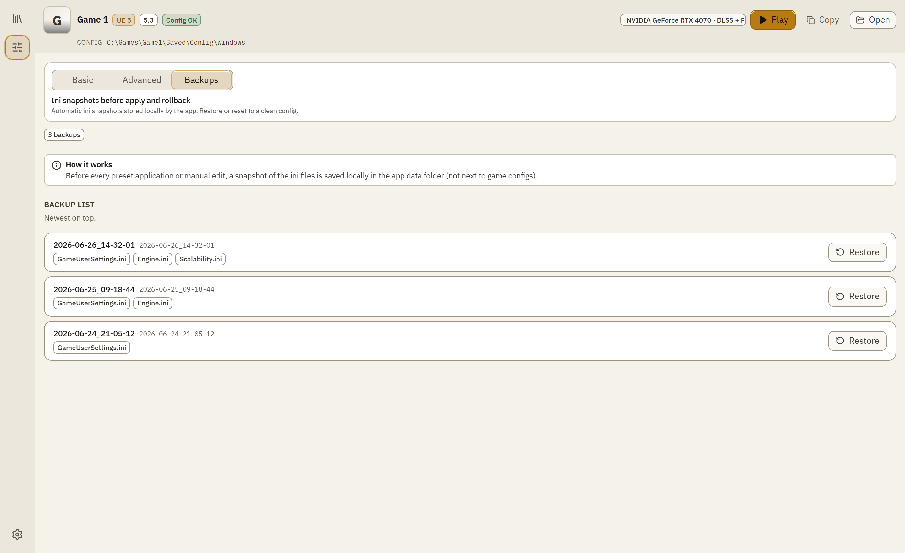

<p align="center">
  
</p>

<h1 align="center">Game Settings Master</h1>

<p align="center">
  <a href="README.md">Русский</a> ·
  <a href="README.en.md">English</a> ·
  <a href="https://gsm-tool.com/en/">Website</a> ·
  <a href="https://www.donationalerts.com/r/mike_saito">Donate</a>
</p>

<p align="center">
  <a href="https://github.com/MikeSaito/Game-Settings-Master/releases"></a>
  
  
  <a href="https://gsm-tool.com/"></a>
</p>

<p align="center">
  <strong>Ini editor for Unreal Engine games</strong><br>
  GameUserSettings and Engine.ini in one window — with hints, backups, and GPU-aware filters.
</p>

<p align="center">
  <code>UE 4.27</code> · <code>UE 5.8</code> · <code>Steam</code> · <code>Epic</code> · <code>DLSS</code> · <code>FSR</code>
</p>

---

## Screenshots

<p align="center">
  
  &nbsp;&nbsp;
  
</p>

<p align="center">
  
  &nbsp;&nbsp;
  
</p>

---

## Features

| | |
|---|---|
| **Game library** | Steam and Epic scan, manual add. Finds config folders and shows game context — engine, paths, cover art. |
| **Basic / Advanced** | **Basic** — GameUserSettings.ini: sg.*, resolution, window mode, VSync — like in-game menus. **Advanced** — Engine.ini CVars with tier hints, warnings, and a Recommended filter. |
| **Backups** | Config snapshot before every apply. Roll back to a previous state in one click. |
| **Parameter catalog** | **767** reference keys (UE 4.27–5.8), **115** curated RU/EN descriptions, tier A/B overlays. Keys injected by game engine version. |
| **GPU-aware filters** | DLSS, FSR, ray tracing, and Frame Generation only show when your GPU supports them. |

---

## Download

**Windows · free · MIT · unsigned build**

| | |
|---|---|
| Installer | [**Game-Settings-Master_1.0.2-a_x64-setup.exe**](https://github.com/MikeSaito/Game-Settings-Master/releases/latest/download/Game-Settings-Master_1.0.2-a_x64-setup.exe) |
| Releases | [github.com/MikeSaito/Game-Settings-Master/releases](https://github.com/MikeSaito/Game-Settings-Master/releases) |
| Website | [gsm-tool.com](https://gsm-tool.com/) |

### First launch (SmartScreen)

The build is unsigned — Windows may show a blue warning. Normal for indie software.

1. **More info**
2. **Run anyway**

After the first run, Windows usually stops asking. Source is open — you can verify the build yourself.

---

## Development

### Requirements

Node.js 20+ · Rust (stable) + MSVC · Python 3.10+ (UE catalog build)

### Quick start

```powershell
npm ci
powershell -File scripts/install-githooks.ps1

npm run tauri dev     # desktop (Vite + Tauri)
npm test              # Vitest
npm run build         # production frontend
npm run landing:dev   # gsm-tool.com landing
```

After changing IPC DTOs in Rust: `npm run types:gen`

### Layout

```
src/                      React SPA (@/ → src/)
src-tauri/src/            Rust: commands, ini, discovery, catalog
landing/                  gsm-tool.com site (GitHub Pages)
tools/ue-catalog-builder/ Python UE catalog pipeline
docs/                     ARCHITECTURE, parameter-sources, epic-clone-setup
```

Full module map — [`docs/ARCHITECTURE.md`](docs/ARCHITECTURE.md).

### UE catalog (brief)

| Layer | Count |
|-------|-------|
| Reference index | **767** keys (UE 4.27–5.8) |
| Curated descriptions | **115** keys RU+EN |
| Tier A / B overlays | **748** / **150** |

Rebuild: [`docs/epic-clone-setup.md`](docs/epic-clone-setup.md) · [`docs/parameter-sources.md`](docs/parameter-sources.md) · current counts in `src-tauri/catalog/generated/merge_stats.json`

### Pre-PR checks

```powershell
npm test
npm run build
cd src-tauri; cargo test
python tools/ue-catalog-builder/test_build.py
npm run landing:build
```

---

## Documentation

| File | Contents |
|------|----------|
| [`docs/ARCHITECTURE.md`](docs/ARCHITECTURE.md) | Code layout and module boundaries |
| [`docs/parameter-sources.md`](docs/parameter-sources.md) | Where parameter descriptions come from |
| [`docs/epic-clone-setup.md`](docs/epic-clone-setup.md) | Epic UE clone and catalog rebuild |
| [`tools/ue-catalog-builder/README.md`](tools/ue-catalog-builder/README.md) | Python pipeline |

---

<p align="center">
  <a href="LICENSE">MIT License</a> © 2026 Mike Saito
</p>
