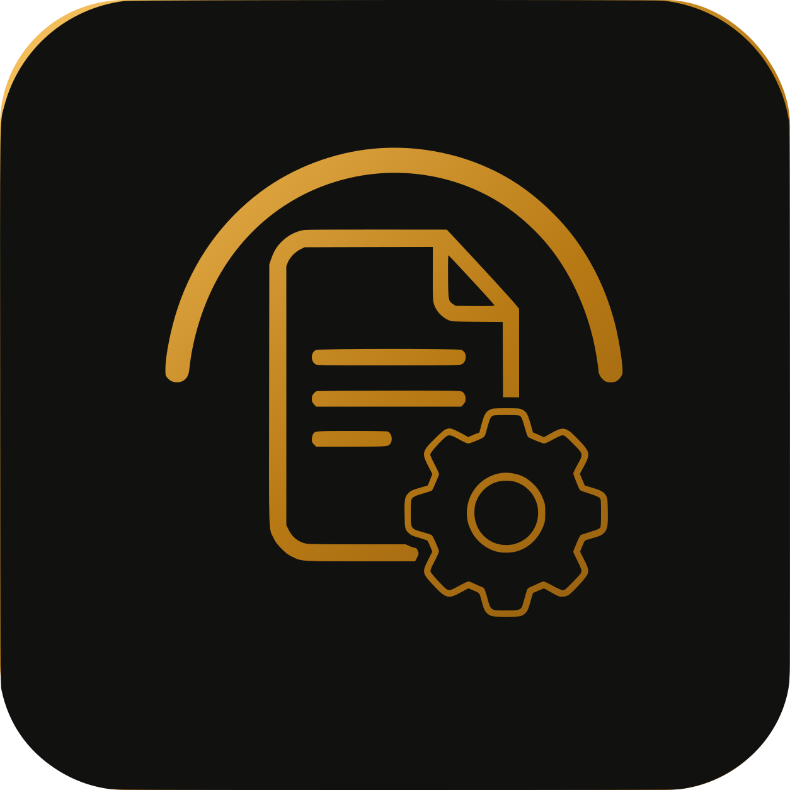
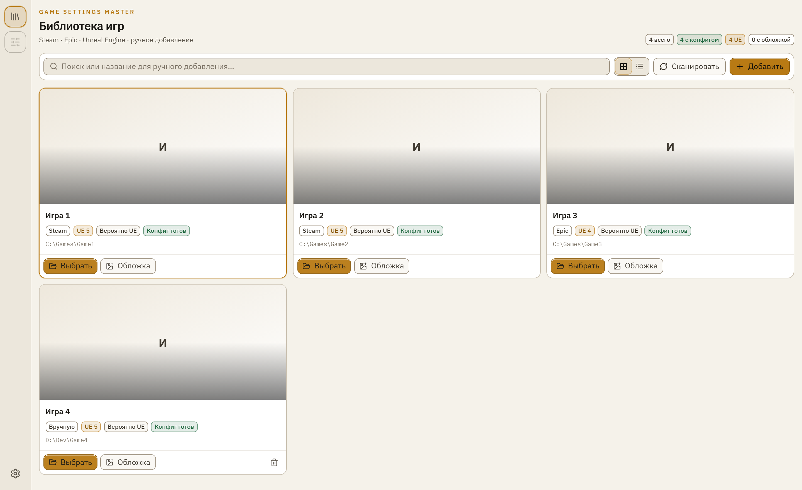
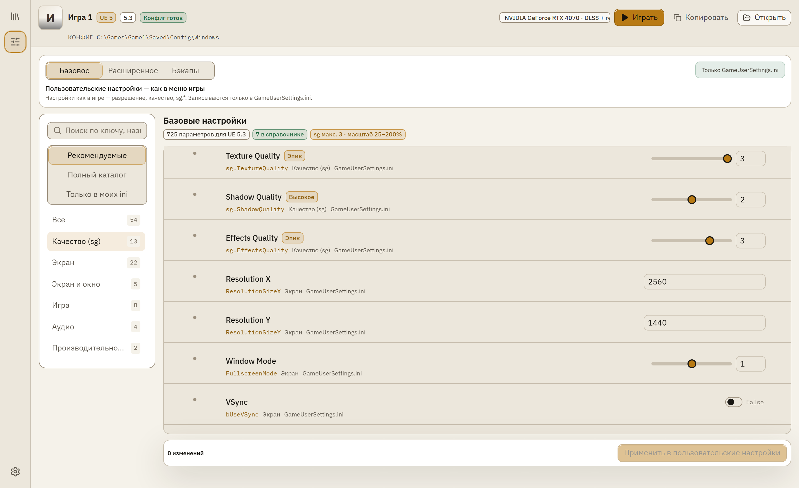
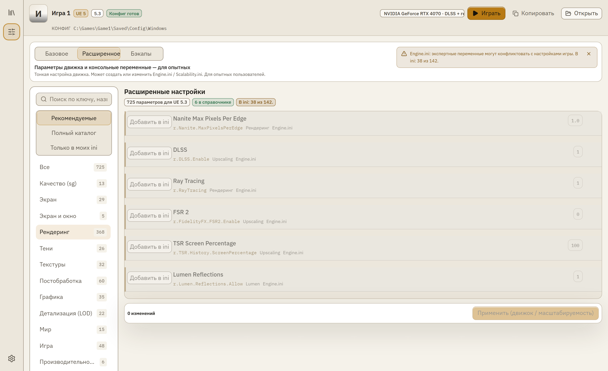
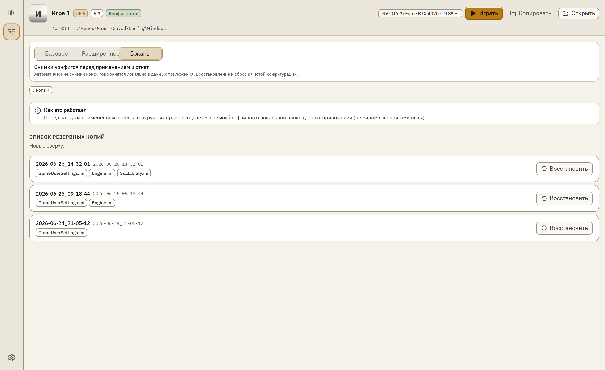

<p align="center">
  
</p>

<h1 align="center">Game Settings Master</h1>

<p align="center">
  <a href="README.md">Русский</a> ·
  <a href="README.en.md">English</a> ·
  <a href="https://gsm-tool.com/">Сайт</a> ·
  <a href="https://www.donationalerts.com/r/mike_saito">Поддержать</a>
</p>

<p align="center">
  <a href="https://github.com/MikeSaito/Game-Settings-Master/releases"></a>
  
  
  <a href="https://gsm-tool.com/"></a>
</p>

<p align="center">
  <strong>Редактор ini для игр на Unreal Engine</strong><br>
  GameUserSettings и Engine.ini в одном окне — с подсказками, бэкапами и фильтрами под вашу видеокарту.
</p>

<p align="center">
  <code>UE 4.27</code> · <code>UE 5.8</code> · <code>Steam</code> · <code>Epic</code> · <code>DLSS</code> · <code>FSR</code>
</p>

---

## Скриншоты

<p align="center">
  
  &nbsp;&nbsp;
  
</p>

<p align="center">
  
  &nbsp;&nbsp;
  
</p>

---

## Возможности

| | |
|---|---|
| **Библиотека игр** | Сканирование Steam и Epic, ручное добавление. Приложение находит папку конфигов и показывает контекст игры — движок, пути, обложку. |
| **Basic / Advanced** | **Basic** — GameUserSettings.ini: sg.*, разрешение, окно, VSync — как в меню игры. **Advanced** — Engine.ini и CVars с tier-подсказками, предупреждениями и фильтром «Рекомендуемые». |
| **Резервные копии** | Снимок конфигов перед каждым применением. Откат к предыдущему состоянию в один клик. |
| **Каталог параметров** | **767** справочных ключей (UE 4.27–5.8), **115** ручных описаний RU/EN, tier A/B overlays. Подмешивание ключей по версии движка игры. |
| **Фильтры под GPU** | DLSS, FSR, трассировка и Frame Generation показываются только если видеокарта поддерживает. |

---

## Скачать

**Windows · бесплатно · MIT · без подписи издателя**

| | |
|---|---|
| Установщик | [**Game-Settings-Master_1.0.2-a_x64-setup.exe**](https://github.com/MikeSaito/Game-Settings-Master/releases/latest/download/Game-Settings-Master_1.0.2-a_x64-setup.exe) |
| Релизы | [github.com/MikeSaito/Game-Settings-Master/releases](https://github.com/MikeSaito/Game-Settings-Master/releases) |
| Сайт | [gsm-tool.com](https://gsm-tool.com/) |

### Первый запуск (SmartScreen)

Сборка без коммерческой подписи — Windows может показать синее предупреждение. Для indie-софта это нормально.

1. **Подробнее**
2. **Выполнить в любом случае**

После первого запуска Windows обычно больше не спрашивает. Исходники открыты — можно проверить сборку самостоятельно.

---

## Разработка

### Требования

Node.js 20+ · Rust (stable) + MSVC · Python 3.10+ (сборка каталога UE)

### Быстрый старт

```powershell
npm ci
powershell -File scripts/install-githooks.ps1

npm run tauri dev     # desktop (Vite + Tauri)
npm test              # Vitest
npm run build         # production frontend
npm run landing:dev   # лендинг gsm-tool.com
```

После изменения IPC DTO в Rust: `npm run types:gen`

### Структура

```
src/                      React SPA (@/ → src/)
src-tauri/src/            Rust: commands, ini, discovery, catalog
landing/                  сайт gsm-tool.com (GitHub Pages)
tools/ue-catalog-builder/ Python pipeline каталога UE
docs/                     ARCHITECTURE, parameter-sources, epic-clone-setup
```

Подробная карта модулей — [`docs/ARCHITECTURE.md`](docs/ARCHITECTURE.md).

### Каталог UE (кратко)

| Слой | Счётчик |
|------|---------|
| Справочный индекс | **767** ключей (UE 4.27–5.8) |
| Ручные описания | **115** ключей RU+EN |
| Tier A / B overlays | **748** / **150** |

Пересборка: [`docs/epic-clone-setup.md`](docs/epic-clone-setup.md) · [`docs/parameter-sources.md`](docs/parameter-sources.md) · актуальные цифры в `src-tauri/catalog/generated/merge_stats.json`

### Проверка перед PR

```powershell
npm test
npm run build
cd src-tauri; cargo test
python tools/ue-catalog-builder/test_build.py
npm run landing:build
```

---

## Документация

| Файл | Содержание |
|------|------------|
| [`docs/ARCHITECTURE.md`](docs/ARCHITECTURE.md) | Структура кода и границы модулей |
| [`docs/parameter-sources.md`](docs/parameter-sources.md) | Откуда берутся описания параметров |
| [`docs/epic-clone-setup.md`](docs/epic-clone-setup.md) | Клон Epic UE и пересборка каталога |
| [`tools/ue-catalog-builder/README.md`](tools/ue-catalog-builder/README.md) | Python pipeline |

---

<p align="center">
  <a href="LICENSE">MIT License</a> © 2026 Mike Saito
</p>
