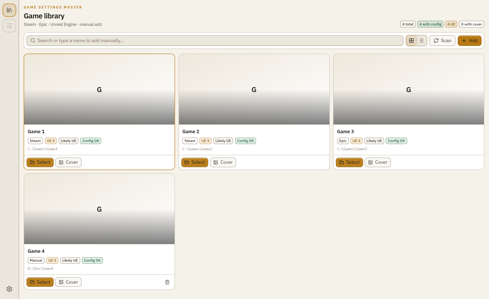
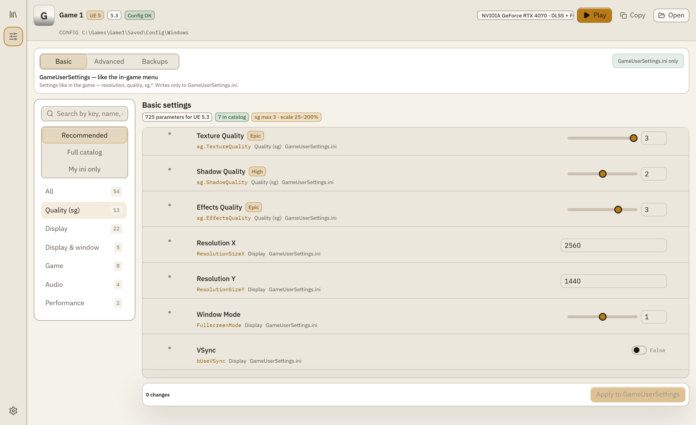
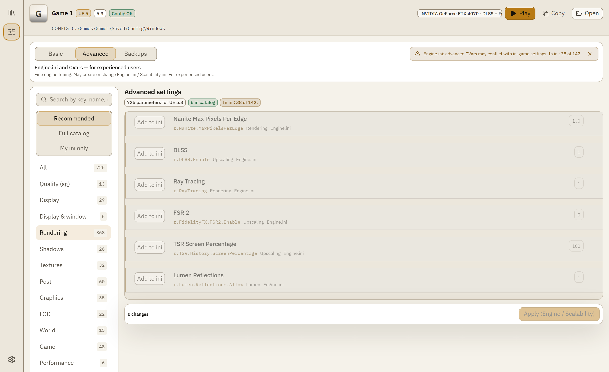
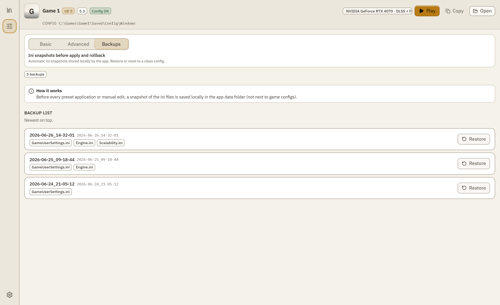

  

<h1 align="center">Game Settings Master</h1>

  <a href="README.md">English</a> ·
  <a href="README.ru.md">Русский</a> ·
  <a href="https://gsm-tool.com/en/">Website</a> ·
  <a href="https://t.me/game_settings_master">Telegram</a> ·
  <a href="https://www.donationalerts.com/r/mike_saito">Donate</a>

  
  
  
  

  <strong>Ini editor for Unreal Engine games</strong> 
  Edit GameUserSettings and Engine.ini in one place — with hints, backups, and filters matched to your GPU.

  <code>UE 4.27–5.8</code> · <code>Steam</code> · <code>Epic</code> · <code>DLSS</code> · <code>FSR</code>

---

## Screenshots

  
  &nbsp;&nbsp;
  

  
  &nbsp;&nbsp;
  

---

## What it does

**Game library** — scans Steam and Epic libraries, supports manual games, finds config folders, and shows engine info and cover art.

**Basic editor** — GameUserSettings.ini: scalability presets, resolution, window mode, VSync — the same knobs you see in-game.

**Advanced editor** — Engine.ini CVars with descriptions, warnings, tier hints, and a Recommended filter for your setup.

**Backups** — automatic snapshot before every apply; restore the previous state in one click.

**Built-in reference** — parameter hints in English and Russian, tuned to the game’s Unreal Engine version.

**GPU-aware UI** — DLSS, FSR, ray tracing, and frame generation options appear only when your graphics card supports them.

---

## Download

Free · Windows · MIT · open source

| | |
|---|---|
| Latest release | [**Download for Windows**](https://github.com/MikeSaito/Game-Settings-Master/releases/latest) |
| Website | [gsm-tool.com](https://gsm-tool.com/en/) |

### First launch (SmartScreen)

The installer is not commercially signed. Windows may show a blue SmartScreen prompt — this is normal for independent software.

1. Click **More info**
2. Click **Run anyway**

After the first successful launch, Windows usually stops showing the warning.

---

  <a href="LICENSE">MIT License</a> © 2026 Mike Saito

