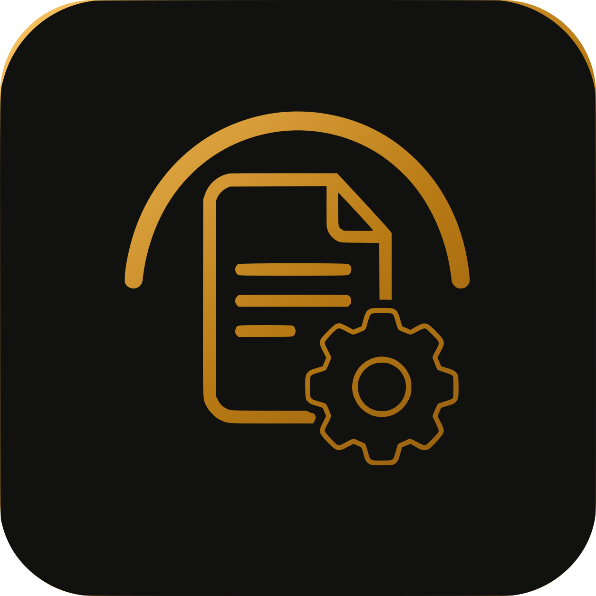
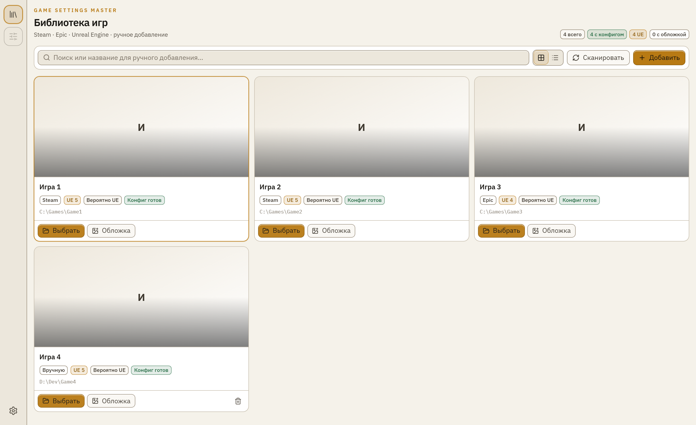
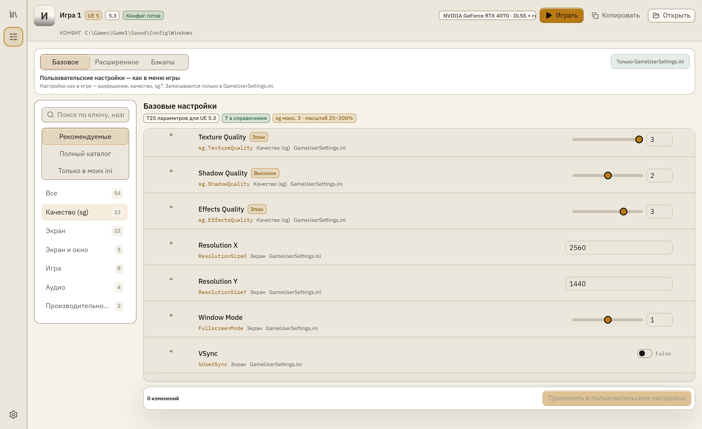
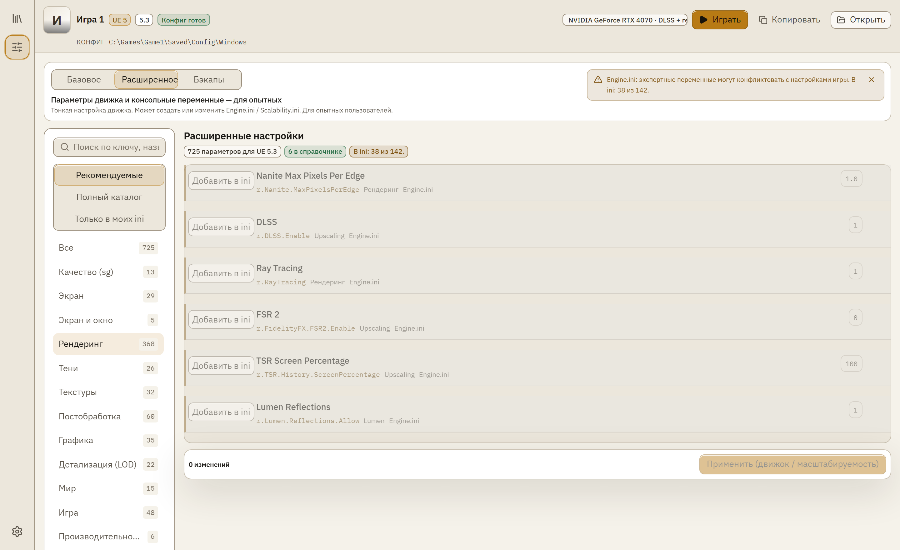
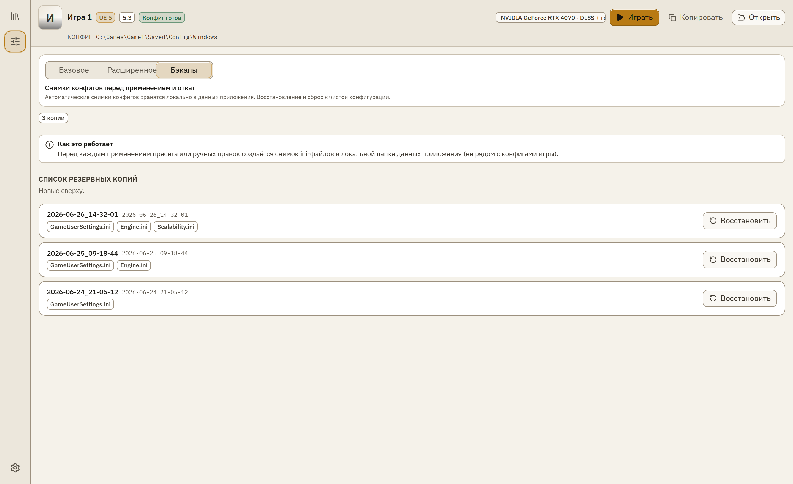

  

<h1 align="center">Game Settings Master</h1>

  <a href="README.md">English</a> ·
  <a href="README.ru.md">Русский</a> ·
  <a href="https://gsm-tool.com/">Сайт</a> ·
  <a href="https://t.me/game_settings_master">Telegram</a> ·
  <a href="https://www.donationalerts.com/r/mike_saito">Поддержать</a>

  
  
  
  

  <strong>Редактор ini для игр на Unreal Engine</strong> 
  GameUserSettings и Engine.ini в одном окне — с подсказками, бэкапами и фильтрами под вашу видеокарту.

  <code>UE 4.27–5.8</code> · <code>Steam</code> · <code>Epic</code> · <code>DLSS</code> · <code>FSR</code>

---

## Скриншоты

  
  &nbsp;&nbsp;
  

  
  &nbsp;&nbsp;
  

---

## Возможности

**Библиотека игр** — сканирование Steam и Epic, ручное добавление, поиск папки конфигов, информация о движке и обложка.

**Basic** — GameUserSettings.ini: sg.*, разрешение, режим окна, VSync — как в меню игры.

**Advanced** — Engine.ini и CVars с описаниями, предупреждениями, tier-подсказками и фильтром «Рекомендуемые».

**Резервные копии** — снимок конфигов перед каждым применением; откат в один клик.

**Справочник параметров** — подсказки на русском и английском с учётом версии Unreal Engine игры.

**Фильтры под GPU** — DLSS, FSR, трассировка и Frame Generation показываются только при поддержке видеокартой.

---

## Скачать

Бесплатно · Windows · MIT · открытый исходный код

| | |
|---|---|
| Последний релиз | [**Скачать для Windows**](https://github.com/MikeSaito/Game-Settings-Master/releases/latest) |
| Сайт | [gsm-tool.com](https://gsm-tool.com/) |

### Первый запуск (SmartScreen)

Установщик без коммерческой подписи. Windows может показать синее предупреждение — для indie-софта это нормально.

1. **Подробнее**
2. **Выполнить в любом случае**

После первого успешного запуска Windows обычно больше не спрашивает.

---

  <a href="LICENSE">MIT License</a> © 2026 Mike Saito

